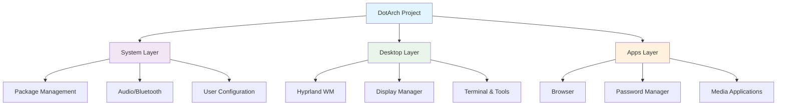

# 🚀 DotArch - Multi-Distribution Desktop Environment

> Personal Ansible project for automated Hyprland desktop deployment on Arch Linux and Ubuntu Server

This project automates the complete setup of a modern desktop environment using Hyprland window
manager, supporting both Arch Linux and Ubuntu distributions through a unified codebase with
distribution-specific optimizations.

## 🎯 Project Overview



## ✨ Features

A complete, minimalist, and visually appealing desktop experience:

* **Desktop Environment**: Full [Hyprland](https://github.com/hyprwm/Hyprland) experience with a
  focus on aesthetics and performance.
* **Tiling Experience**: i3-like manual tiling layout via [hy3](https://github.com/outfoxxed/hy3)
  plugin.
* **Wallpaper**: Automated wallpaper management
  with [Hyprpaper](https://github.com/hyprwm/hyprpaper).
* **Screen Management**: Automatic multi-monitor profiling
  with [Kanshi](https://github.com/emersion/kanshi).
* **Bar**: Fully configured [Waybar](https://github.com/Alexays/Waybar) with status modules.
* **Power Management**: Automated idle and locking
  with [Hypridle](https://github.com/hyprwm/hypridle)
  and [Hyprlock](https://github.com/hyprwm/hyprlock).
* **Display Manager**: Minimal console-based login manager
  via [Greetd](https://git.sr.ht/~kennylevinsen/greetd)
  and [Tuigreet](https://github.com/apognu/tuigreet).
* **Launcher & Clipboard**: [Vicinae](https://github.com/apps-helper/vicinae) for application
  launching and clipboard history management.
* **Terminal**: [Kitty](https://github.com/kovidgoyal/kitty) terminal emulator
  with [Zsh](https://www.zsh.org/).
* **Shell Toolset**: Complete modern toolset including `rg` (ripgrep), `fd`, `bat`, `eza`, and
  completion plugins.
* **File Explorer**: Terminal-based file manager [Yazi](https://github.com/sxyazi/yazi).
* **Notifications**: Beautiful notification center
  via [SwayNC](https://github.com/ErikReider/SwayNotificationCenter).
* **Screenshots**: Advanced screenshotting with annotation support
  using [Grim](https://github.com/emersion/grim), [Slurp](https://github.com/emersion/slurp),
  and [Satty](https://github.com/gabm/Satty).
* **Screen Recording**: Simple recording with `wl-screenrec`.
* **Maintenance**: Automated trash cleanup and system maintenance timers.

## 🛠️ Quick Start

### Prerequisites

**On the Control Machine:**

* **uv**: Modern Python package manager (required to run the project).

**On the Target Machine(s):**

* **User**: A user with `sudo` access (NOPASSWD recommended for automation).
* **SSH Access**: SSH key deployed (`ssh-copy-id user@host`).
* **Python**: Python installed on the target system.

### Setup

1. **Clone the project**
2. **Install Dependencies**:
   ```bash
   uv venv
   uv sync
   ```

### Configuration

1. **Configure Inventory**:
   Create an `inventory.ini` file with your target hosts.

2. **Set Deployment Variables**:
   Configuration is managed directly via YAML files. Check the following files for available
   options (variables are documented in the files):
    * Global Settings: `group_vars/all/variables.yml`
    * Feature Toggles: `group_vars/all/deployment_config.yml`
    * Secrets: `group_vars/all/vault.yml`

3. **Setup Vault** (optional):
   To secure your secrets, use the provided encryption script. It automatically detects unencrypted files and encrypts them using `password.sh` (or interactive password).

   **Encrypt files:**
   ```bash
   ./encrypt.sh
   ```

   **Install Git Safety Hook:** (Recommended)
   Prevents accidental commits of unencrypted secrets.
   ```bash
   ./encrypt.sh --install-hook
   ```

### Deploy

Run the playbook using `uv run`:

```bash
# Test connectivity
uv run ansible all -m ping

# Deploy everything
uv run ansible-playbook playbook.yml

# Deploy specific components
uv run ansible-playbook playbook.yml --tags "system"
uv run ansible-playbook playbook.yml --tags "desktop"
uv run ansible-playbook playbook.yml --tags "apps"
```

## 🏷️ Tag Strategy

| Tag       | Scope               | Usage              |
|-----------|---------------------|--------------------|
| `system`  | Base system setup   | `--tags "system"`  |
| `desktop` | Desktop environment | `--tags "desktop"` |
| `apps`    | User applications   | `--tags "apps"`    |
| `config`  | Configuration only  | `--tags "config"`  |

## 🏗️ Project Structure

```
DotArch/
├── playbook.yml                 # Main playbook
├── inventory.ini                # Host definitions
├── group_vars/
│   ├── all/
│   │   ├── variables.yml        # Global variables
│   │   ├── deployment_config.yml # Feature configuration
│   │   └── vault.yml           # Encrypted secrets
│   ├── arch/main.yml           # Arch-specific settings
│   └── ubuntu/main.yml         # Ubuntu-specific settings
├── roles/
│   ├── system/core/            # Base system configuration
│   ├── users/shell/            # User environment
│   ├── desktop/                # Desktop components
│   │   ├── hyprland/          # Window manager
│   │   ├── greetd/            # Display manager
│   │   ├── terminal/          # Terminal emulator
│   │   ├── vicinae/           # Launcher & Clipboard
│   │   ├── waybar/            # Status bar
│   │   ├── notifications/     # Notification center
│   │   ├── fonts/             # Font management
│   │   └── ...
│   ├── apps/                  # User applications
│   └── profiles/
│       └── desktop-hyprland/  # Complete desktop profile
└── docs/
    └── TAGS.md                # Tag documentation
```

## 🚀 Development & Testing

### Development Mode

Enable development tools by setting `development_mode: true` in
`group_vars/all/deployment_config.yml`.

### Molecule Testing

Run tests using `molecule`:

```bash
# Test on default platform
uv run molecule test

# Test specific scenario
uv run molecule create
uv run molecule converge
```

## 📄 License

MIT License - See LICENSE file for details.
